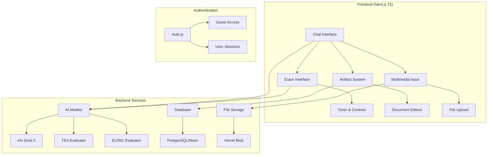
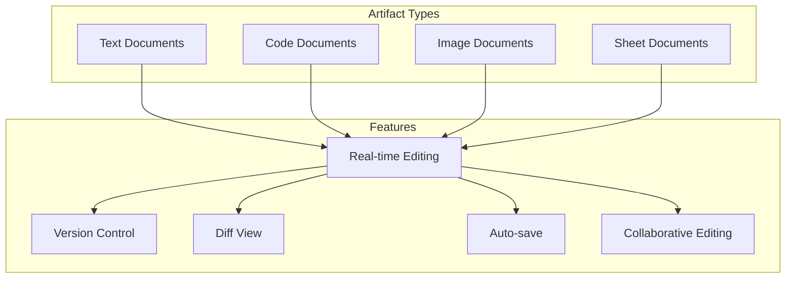
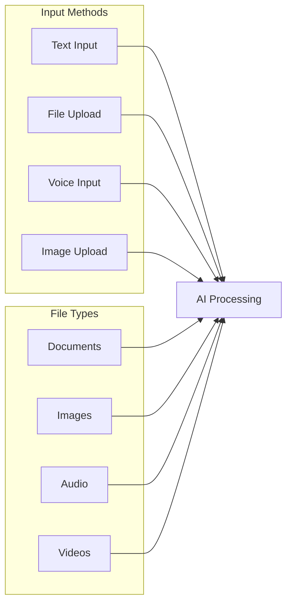
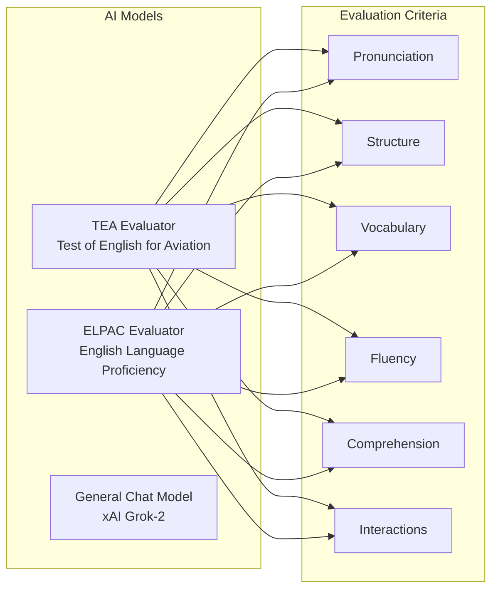
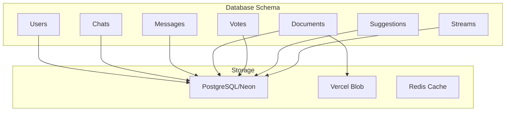

<a href="https://github.com/vercel/ai-chatbot">
  
  <h1 align="center">ICAO AI Chatbot</h1>
</a>

<p align="center">
    An AI-powered chatbot specifically designed for ICAO (International Civil Aviation Organization) aviation professionals, providing intelligent assistance for aviation regulations, procedures, and training.
</p>

<p align="center">
  <a href="#features"><strong>Features</strong></a> ·
  <a href="#aviation-capabilities"><strong>Aviation Capabilities</strong></a> ·
  <a href="#architecture"><strong>Architecture</strong></a> ·
  <a href="#model-providers"><strong>Model Providers</strong></a> ·
  <a href="#deploy-your-own"><strong>Deploy Your Own</strong></a> ·
  <a href="#running-locally"><strong>Running locally</strong></a>
</p>
<br/>

## 🏗️ Architecture Overview



## Features

### 🎯 Core Features

- **Next.js 15 App Router**
  - Advanced routing for seamless navigation and performance
  - React Server Components (RSCs) and Server Actions for server-side rendering and increased performance
- **AI SDK Integration**
  - Unified API for generating text, structured objects, and tool calls with LLMs
  - Hooks for building dynamic chat and generative user interfaces
  - Supports xAI (default), OpenAI, Fireworks, and other model providers
- **Modern UI/UX**
  - Styling with [Tailwind CSS](https://tailwindcss.com)
  - Component primitives from [Radix UI](https://radix-ui.com) for accessibility and flexibility
  - Responsive design for mobile and desktop
  - Dark/Light theme support
- **Data Persistence**
  - [Neon Serverless Postgres](https://vercel.com/marketplace/neon) for saving chat history and user data
  - [Vercel Blob](https://vercel.com/storage/blob) for efficient file storage
- **Authentication**
  - [Auth.js](https://authjs.dev) for simple and secure authentication
  - Guest access for immediate use

### 🤖 AI-Powered Chat Interface

- **Multi-Model Support**: xAI Grok-2 (default), OpenAI, Fireworks, and other providers
- **Real-time Streaming**: Live message generation with typing indicators
- **Message History**: Persistent chat sessions with pagination
- **Vote System**: Users can upvote/downvote AI responses
- **Message Editing**: Edit and regenerate responses
- **Reasoning Display**: Shows AI's thinking process
- **Markdown Support**: Rich text formatting
- **Code Highlighting**: Syntax highlighting for code blocks

### 📝 Artifact System (Document Creation & Editing)



**Document Features:**

- **Multiple Formats**: Text, code, images, spreadsheets
- **Version History**: Track changes and revert
- **Real-time Collaboration**: Multiple users can edit
- **Auto-save**: Automatic content preservation
- **Diff View**: Compare different versions
- **AI Suggestions**: Get improvement suggestions

### 🎤 Multimodal Input System



**Features:**

- **File Upload**: Support for multiple file types
- **Voice Input**: Speech-to-text capabilities
- **Image Analysis**: AI can process and describe images
- **Document Processing**: Extract and analyze document content
- **Audio Controls**: Playback and recording features

## Aviation Capabilities

This ICAO AI Chatbot is specifically designed for aviation professionals and includes specialized AI models for aviation training and assessment:

### 🛩️ Aviation-Specific AI Models



### 📋 TEA (Test of English for Aviation) System

**Exam Structure:**

- **Section 1**: Interview and Experience (7-8 minutes)
- **Section 2**: Interactive Comprehension (8-12 minutes)
  - Part 2A: Non-routine situations
  - Part 2B: Detailed problems
  - Part 2C: General situations
- **Section 3**: Description and Discussion (10 minutes)
  - Part 3A: Image description
  - Part 3B: General discussion

**Features:**

- **Timed Sections**: Automatic timers for each section
- **Progressive Navigation**: Locked sections until completion
- **Real-time Evaluation**: Live scoring based on ICAO criteria
- **Comprehensive Feedback**: Detailed assessment reports
- **Section Controls**: Smart progression between sections/subsections

### 🎓 ELPAC (English Language Proficiency Assessment) System

**Exam Structure:**

- **Section 1**: Listening (30 minutes)
- **Section 2**: Reading (45 minutes)
- **Section 3**: Writing (45 minutes)
- **Section 4**: Speaking (20 minutes)

### 🛠️ AI Tools & Integrations

**Built-in Tools:**

- **Weather API**: Get current weather information
- **Document Creation**: AI-powered document generation
- **Exam Section Control**: Manage exam progression
- **Suggestion System**: AI-powered improvement suggestions
- **Document Updates**: Real-time document editing

### 📊 Data Management & Persistence



**Features:**

- **Chat History**: Persistent conversation storage
- **User Sessions**: Authentication and session management
- **File Storage**: Secure file upload and storage
- **Data Streaming**: Real-time data flow
- **Caching**: Performance optimization

## Model Providers

This template ships with [xAI](https://x.ai) `grok-2-1212` as the default chat model. However, with the [AI SDK](https://sdk.vercel.ai/docs), you can switch LLM providers to [OpenAI](https://openai.com), [Anthropic](https://anthropic.com), [Cohere](https://cohere.com/), and [many more](https://sdk.vercel.ai/providers/ai-sdk-providers) with just a few lines of code.

## Technical Stack

**Frontend:**

- Next.js 15 with App Router
- React 19 (RC)
- TypeScript
- Tailwind CSS
- Framer Motion
- Radix UI components

**Backend:**

- AI SDK (Vercel)
- xAI Grok-2 (default model)
- PostgreSQL (Neon)
- Vercel Blob storage
- Auth.js

**Development:**

- Biome (linting/formatting)
- Playwright (testing)
- Drizzle ORM
- SWR (data fetching)

## Deploy Your Own

You can deploy your own version of the ICAO AI Chatbot to Vercel with one click:

[](https://vercel.com/new/clone?repository-url=https%3A%2F%2Fgithub.com%2Fvercel%2Fai-chatbot&env=AUTH_SECRET&envDescription=Learn+more+about+how+to+get+the+API+Keys+for+the+application&envLink=https%3A%2F%2Fgithub.com%2Fvercel%2Fai-chatbot%2Fblob%2Fmain%2F.env.example&demo-title=ICAO+AI+Chatbot&demo-description=An+AI-powered+chatbot+for+ICAO+aviation+professionals+built+with+Next.js+and+the+AI+SDK.&demo-url=https%3A%2F%2Fchat.vercel.ai&products=%5B%7B%22type%22%3A%22integration%22%2C%22protocol%22%3A%22ai%22%2C%22productSlug%22%3A%22grok%22%2C%22integrationSlug%22%3A%22xai%22%7D%2C%7B%22type%22%3A%22integration%22%2C%22protocol%22%3A%22storage%22%2C%22productSlug%22%3A%22neon%22%2C%22integrationSlug%22%3A%22neon%22%7D%2C%7B%22type%22%3A%22integration%22%2C%22protocol%22%3A%22storage%22%2C%22productSlug%22%3A%22upstash-kv%22%2C%22integrationSlug%22%3A%22upstash%22%7D%2C%7B%22type%22%3A%22blob%22%7D%5D)

## Running locally

You will need to use the environment variables [defined in `.env.example`](.env.example) to run the ICAO AI Chatbot. It's recommended you use [Vercel Environment Variables](https://vercel.com/docs/projects/environment-variables) for this, but a `.env` file is all that is necessary.

> Note: You should not commit your `.env` file or it will expose secrets that will allow others to control access to your various AI and authentication provider accounts.

1. Install Vercel CLI: `npm i -g vercel`
2. Link local instance with Vercel and GitHub accounts (creates `.vercel` directory): `vercel link`
3. Download your environment variables: `vercel env pull`

```bash
pnpm install
pnpm dev
```

Your app should now be running on [localhost:3000](http://localhost:3000).

## 🚀 Deployment & Infrastructure

- **Vercel Deployment**: One-click deployment
- **Environment Variables**: Secure configuration
- **Database Migrations**: Automated schema updates
- **File Storage**: Scalable blob storage
- **CDN**: Global content delivery

---

This ICAO AI Chatbot is a comprehensive aviation training and assistance platform that combines cutting-edge AI technology with specialized aviation knowledge, making it an invaluable tool for aviation professionals seeking to improve their English language proficiency and understanding of ICAO standards.
